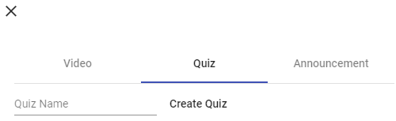
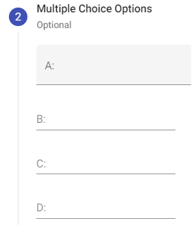
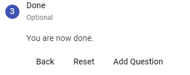
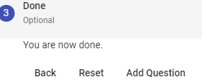
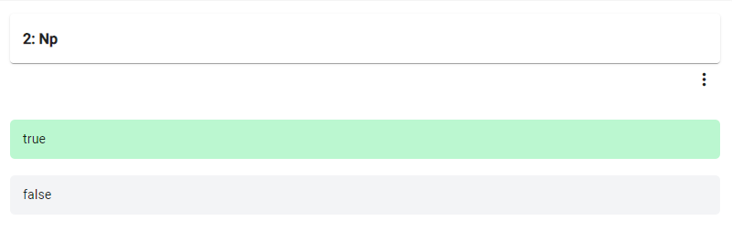
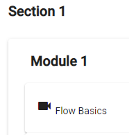

RefReps Learning Management System

User Manual

----------

## Navigation
How-To:

# Register
1. When at the login page   
2. Select the "Register" button 
3. You will be brought new page with textboxes 
4. Enter your first and last name, email, and password
5. Click "Sign Up" 
6. You can now use that information to login to the system (it should automatically log you in upon clicking sign up)

# Login
1. When at the login page   
2. Enter your email and password that belongs to your account in the corresponding textboxes 
3. When credentials are added click login button
4. You should be logged in and at the home page

# Adding the First Admin to the Database
1. Make sure to have a registered user (know the email)
2. Connect to the mongodb database
   - Recommendation: Use `MongoDB Compass` to connect to the database
   - If connecting to a local database, use `mongodb://localhost:27017` as the connection string
   - If using a dockerized mongodb image, make sure to connect to the ip address in the connection string, e.g., `mongodb://10.0.0.73:27017`
   - If using a cloud provider, make sure to use the correct connection string.
3. Using MongoDB Compass
   - Click on the refreps database, and click the users collection.
   - Edit the role of the desired user. Change role: `user` to role: `admin`
4. Using the mongo shell
   - Use the refreps database `use refreps`
   - Enter: `db.users.updateMany({email: {$eq: 'admin@email.com'}}, {$set: {role: 'admin'}})` where admin@email.com is the desired account email you wish to make an admin

# Displaying all Users (Admin)
1. Once logged in as an admin, navigate to `list all users` on the sidnav 
2. Notice the users listed 
3. Feel free to use the filter users. (searches search across email, name, and role)

# Updating a User's Password (Admin)
1. Navigate to display all users [click here to see how](#displaying-all-users-admin)
2. When looking at the users, click the menu edit button on the user row, then click `change password`
3. When prompted, enter the new password (and confirm)

4. Click `Confirm` to accept this change

# View Available Courses 
1. From the sidebar on the left side, click the Courses button  
   This will bring you to the course dashboard that shows all the available courses

# Join an Existing Course 
**You must have registered for an account to join a course**
## Join a course by the invite code 
1. If you need to join a course, contact your instructor for a course coupon code. 
2. Once in possession of an invite code, navigate to the available courses. 
3. At the bottom of the available courses, there will be a text box to enter a coupon code. 
4. Type the code provided by your instructor and press "Join Course"
5. The page will reload nd you will be added to the course

## Join a course by the link
1. If your instructor sent you a link instead of a code log in to your account and paste the link into the URL section of your browser. 

2. The page will reload and you will be added to the course. 

# Admin/Author View 
## Add a Course (Admin)
1. From the sidebar on the left of the screen, click the Create Course tab,  underneath the available course button 
- The application allows users to create a course from scratch and to copy an existing course along with any exisiting material

### Create a course from scratch
1. To create a course from scratch, click the "Create New Course" button   
- This will bring you to a dialog box 
    
2. Enter the desired course name into the text box.
3. If you would like the course to be available on the dashboard once it is created, set the "Publish Course" to be true
4. When the information on the dialog is filled in, press submit 
5. The course will now be available on the dashboard

### Create a course by copying another course
1. To create a copy of an existing course, while in the add course tab, click the "Create From Template" button 
2. This will bring you to a dialog box  
3. In the first box, select the existing course you would like to copy
4. Enter the name for the new course
5. Then press "Submit" to complete the copy
6. The new course can now be seen and accessed from the view course tab 

Alternatively, you may also copy a course from the dashboard and click the menu to copy a course. This will auto populate the course information. (see picture below)

## Delete a Course (Admin)
1. Follow the steps above to get to the course dashboard
2. Select the menu icon (3 dots on the course card) 

3. Click the delete option
4. When prompted with the dialog, enter the course name in the input 

5. Click the delete button to confirm deleting the course (this will soft delete the course)

## View Content in Available courses
1. Follow the steps above to get to the course dashboard 

2. Click on the desired course name
3. When the course page loads the section and module info will load  

4. The files housed in the module will be listed

## Building out a curriculum
### Add Section to Available Course
1. When viewing the content in courses click the edit curriculum button at the bottom right of the content dashboard 
2. In the edit curriculum page, click the "Add New Section" button 
3. A dialog box will appear, enter the desired section name, and click the submit button to finish the section creation process   
4. The section name will populate the screen when completed
5. Click the "finish button" at the bottom of the page to finish the curriculum editing process
### Add Module to a Section
1. Refer to the first step of the last instruction to get to the edit curriculum page
2. A section is needed to create a module, if there are no sections available, follow the steps above to create one.
3. To the right of the section name, click the three vertical dots 
4. A small box will appear underneath the three dots, click the blue "+" button  
5. You will be presented with a dialog box   
6. Enter the desired name of the module
7. Click submit to finish adding the module to the current section
8. Click the section name in order to reveal that the module has been added
9. Finally, click the finish button at the bottom of the page to finish the curriculum editing process 
## Add content to a module
- A module is required to add content to a course
### Add video content to a module 
1. From the edit currriculum page, click the three vertical dots to the right of the module name  that you wish to add content to
2. In the dialog box that pops up, be sure to be in the "video" tab 
3. Click the blue paper clip button to open file explorer. Choose the desired file to be upload and click "open" in file explorer. 
4. The dialog box will now have the file, click the green submit button at the bottom of the dialog to add the file to the module.
5. Click the module name in the course to see the uploaded content
6. Click the finish button at the bottom of the page to finish the curriculum editing process
### Add quiz content to a module
1. From the edit currriculum page, click the three vertical dots to the right of the module name  that you wish to add content to
2. In the dialog box that pops up, be sure to be in the "quiz" tab   
3. Enter the desired name for the quiz 
4. Click the "Create Quiz" button 
5. The page will reload and an empty quiz will be made under the selected module
### Add question to a quiz
1. As an author/admin, from the currriculum home page, select the quiz that you would like to edit
2. This will take you to a quiz landing page, click the blue "Edit Quiz" button   
3. If there are already questions in the quiz, scroll to the bottom of the page, click the " Add New Question" button 
4. Add the question that you would like to ask, and select the type of question it will be, i.e. Multiple Choice, True/False, or text box free response
   - The selected question type will change the options that you have moving forward
5. When done entering the question and the type of question, click next.  The next step will change depending on the type of question that was chosen
#### Multiple Choice Question
1. If you selected the "multiple choice" question type, the next step will present you with four textboxes labeled A, B, C, and D respectively. Here you will put in the options that you want to be made available.   
2. Once each option is entered into the text boxes, select the letter that corresponds to the correct answer 
3. When you have entered all the options and selected the correct answer, click "next"
#### True False Question 
1. If you selected the "True False" question type, you will be presented with two buttons   
2. Select the correct answer to the question 
3. When the questions answer has been selected, click "next"
#### Free Response Question 
1. If you selected the "Text" question type, you will be presented with a single text box   
2. Here you will enter the answer to the question
3. When you have filled in the text box with the answer to the question, press "next"
#### Submitting the quiz question 
1. When finished with the question, the next step is to save the question  
2. The user can click "Save Question" to save the question, and then click "Reset" to reset the form and add another question.
3. If the user is done creating the quiz, they can exit the quiz question creation box, and next to the "Add New Question" button

#### Viewing Already Made Quiz 
The questions will be listed with the answer to the question highlighted.  

#### Deleting a quiz question 
1. When looking at the question you want to delete, click the three vertical dots to open an options menu

2. Click the red trashcan to delete the question
3. Click the "Save Quiz" button 

#### Rearranging questions
1. When in the edit quiz page of the quiz you wish to edit, click and drag the question you want to move and drop it on top of where you would like it to be 

2. click the "Save Quiz" button when finished 

### Add Drop Dates to Content
1. In the course curriculum page, click the three vertical dots 
next to the content you would like to add drop dates to.
2. Click the "drop dates" option 
3. Enter the date and time that you want the content to drop at  

### Setting Course Enforcements
- As an admin/author, from the available courses dashboard, click the course that you would like to change course enforcements for
- When in the course, on the side panel to the left of the sections, click "Settings"   
- The top box will be used for changes course enforcements  
- You can turn course enforcements off completely by toggling the "Course Enforcements" toggle
- To change the required quiz grade by percent, enter the percentage desireed next to "Enforcement Percent"
- To change the allowed quiz attempts, enter the amount of attempts next to "Max Quiz Attempts"
- To lock a coupon code as an author, so the code will not work, toggle the "Lock Coupon Code" toggle switch

### View Quiz Grades
1. As an admin/author click on the quiz that you would like to see the grades for
2. It will take you to a landing page where you can see the students submissions and grades  

Alternatively, as a student, you will see only your own attempts for a quiz.

### View Individual Submissions
1. Click the quiz that you would like to view the submissions of
2. Click the eye button next to the students submission in that you wish to see 
3. This will route you to a pgae that shows the details of the students submission  

Note: As a student, you will only be able to view your own submissions

### Viewing Overall Course Grades (Author/Admin)
1. Inside of a course, navigate to the `Grades` tab on the left side
2. You will see a list of all students' overall grades in that course

3. Clicking on the student or eye ball will bring you to that student's best grades for each quiz

### Viewing Overall Course Grades (Student)
1. Inside of a course, navigate to the `Grades` tab on the left side
2. You will see a list of all of your best quiz results and your overall course grade

3. Clicking the eyeball on that page will view that submission
4. Clicking the `i` icon will bring the user to all the grades for that user on the quiz to view all of their attempts.

### Force Completing a Content for a User (Author/Admin)

Force completing content for a user is intended for technical difficulties on the student's end when they are unable to complete a content. 
Force completing will **NOT** give a better grade on that content. 
Force completing **WILL** allow the student to skip over the content if they choose to do so.

1. Go to the edit course ([click here for information to navigate there](#building-out-a-curriculum))
2. Click on the content's menu button you wish to force complete a student on
3. Click `student progress`

4. Notice the progress page 
5. Click the `green circular checkmark` on students you wish to force complete the content

### Keep Content Open 
The progression system follows a top down flow pattern. The first content must be completed to move on to the next. 
Administrators and Instructors can override this when editing the course. ([click here for information to navigate there](#building-out-a-curriculum))
1. While in the edit course page, click the three vertical dots to the right of the content you would like to keep open

 
2. A menu will pop up, click the "Keep Open" option  

  
3. The page will reload and a yellow star will appear to the left of the drop date 

4. To **close** the content again, follow the same steps to open the menu and click the "close" option  

### Delete a Section 
1. From the edit curriculum page, next to the section you wish to delete, press the three vertical dots 
2. A small box will appear under the vertical dots, click the red trashcan button   

### Reorder Section, Module, or Content in a Module
1. From the edit curriculum page, click and hold the name of the component you wish to rearrange and move it to the desired position. 
2. Click the finish button at the bottom of the page to finish the curriculum editing process

## Stream uploaded videos
1. From the course dashboard, click the name of the module in which the content is located to expand the content list  
2. When the list of contents is available, click the name of the video you wish to watch
3. The video will be brought up in another page 

## Add/Remove authors to a course 
- As an admin, from the available courses dashboard, click the course that you would like to add authors to
- When in the course, on the side panel to the left of the sections, click "Authors"   

### Add authors 
1. You will be presented with a text box, enter the email of the author you wish to add to the course 
2. When the auhtors email is entered press the "Add Author" button, the email of the author will be listed below
3. When you are finished adding the auhtors, press the "Complete" button

### Remove Authors
1. Underneath the textbox for "Add Author" there is a textbox for "Remove Author" 
2. Enter the authors email that you wish to remove from the class
3. When the authors email is entered, press the "Remove Author" button 
4. When you are finished removing the authors, press the "Complete" button

## Add/Remove students to a course 
- As an admin or an author, from the available courses dashboard, click the course that you would like to add students to
- When in the course, on the side panel to the left of the sections, click "Students"   

### Add students 
1. You will be presented with a text box, enter the email of the student you wish to add to the course 
2. When the students email is entered press the "Add Student" button, the email of the student will be listed below
3. When you are finished adding the students, press the "Complete" button

### Remove Students
1. Underneath the textbox for "Add Student" there is a textbox for "Remove Student" 
2. Enter the students email that you wish to remove from the class
3. When the students email is entered, press the "Remove Student" button 
4. When you are finished removing the students, press the "Complete" button

## Invite Students to the Course
### Create a Coupon Code (Admin)
- As an admin, from the available courses dashboard, click the course that you would like to invite students to
- When in the course, on the side panel to the left of the sections, click "Settings"   
- In the bottom box, you can customize the settings for the invite code   
- You can set the desired student capacity by entering number next to "Student Capacity"
- You can set the name of the coupon code by typing the name you want next to the section that says "Coupon Code"
- To set the date that the code expires, enter the desired date next to "Coupon Valid Until"
- Click "Save" when you are done
- You can send the Coupon Code name to the students to join

### Get an invite link for students
- As an admin, from the available courses dashboard, click the course that you would like to invite students to
- When in the course, on the side panel to the left of the sections, click "Students"   
- At the bottom of the Students dashboard there is a "Course Link" 
- Copy the link and send it to your students
- The students must have an account registered for the invite link to work for them

# Student View

## Taking a quiz
1. As a student, inside of a course and the courses module, click the name of the quiz you would like to take. 
2. You will be taken to another page that presents you a "Start Quiz" button and the details of your previous submissions.   
3. Go through each question and select or type the answer you wish to provide
4. When all of the questions have an answer, click "Submit" at the bottom of the page 

## Viewing Past Submissions
1. Click the quiz that you would like to view the submission of
2. Click the eye button next to the submission that you wish to see 
3. This will route you to a page that shows the details of your submission   

4. Your questions will be highlighted green if they are right, or red is they are wrong.

## Locked Content
- If there is a lock next to the quiz name, you cannot take the quiz until it is past the lock date.   

## Stream uploaded videos
1. From the course dashboard, click the name of the module in which the video is located to expand the content list   
   - Any file that has ".mp4" is a video that can be watched
3. When the list of contents is available, click the name of the video you wish to watch
4. The video will be brought up in another page 

